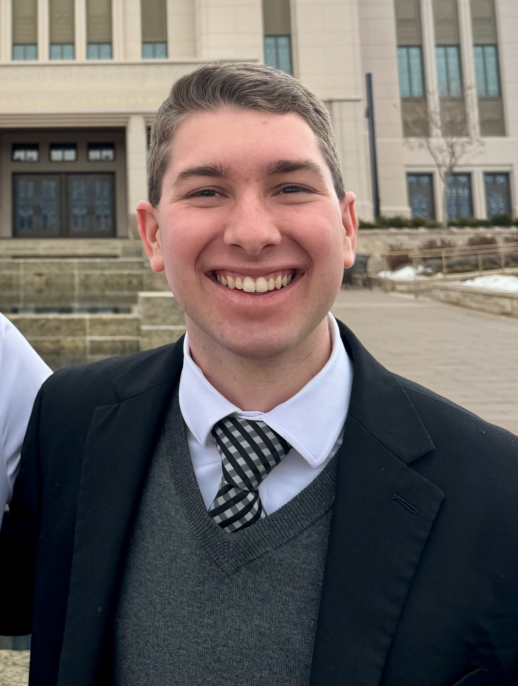

# About Me

I'm Brian Bascom, an undergraduate student in Computer Engineering at Brigham Young University. Current research assistant at the BYU MAGICC Lab.

{ width="200" }

[:material-download: Resume](resources/brian_bascom_resume.pdf){ .md-button }

## Education

Bachelor of Science in Computer Engineering (2027)  
Minor in Computer Science and Mathematics  

### Honors & Awards
* Honors Program  
* Russell M. Nelson Presidential Scholar  
* National Merit Scholar

### Skills

* Programming Languages: Rust, C, C++, Python, Java
* Developer Tools: Git, VS Code, Linux, Docker, CMake
* Hardware & Lab: Raspberry Pi, UAVs, STM32 Microcontrollers, KiCad
* Software: PyTorch, JAX, ONNX

### Interests

* Control Theory
* Machine Learning
* Embedded Systems
* Robotics
* Rust Programming Language

## Projects

View my projects on my [projects](portfolio/projects_simplified.md) page of this website