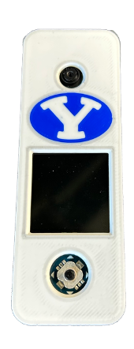
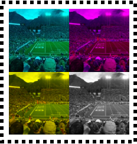
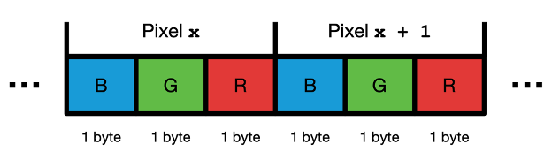
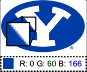

# Raspberry Pi Doorbell [:simple-git:](https://github.com/bascom16/doorbell_demo){ .md-button .md-button--small }

In ECEN 224 (Intro to Computer Systems) I created a Raspberry Pi Doorbell system. This project included a Raspberry Pi Zero, LCD hat, and camera module in a 3D printed case. I loved building and programming the doorbell during this class. 

As a part of the [IMMERSE](https://immerse.byu.edu/about-immerse) program, I was given the assignment to create a demonstration of the doorbell to be used for new student orientation. I decided to redesign the cover to show off the device's hardware. I laser cut a transparent acrylic cover and 3D printed some parts to replace the original case. I assembled this demonstration and programmed it with a custom program that showcases a few of the doorbell's features with a focus on the camera functionality and basic digital image processing. The following is a part of the demonstration guide I wrote for new student orientation to accompany the device.

---

## Doorbell Demo

Students in ECEN 224 (Intro to Computer Systems) learn to program a video doorbell in their lab!

This code is a simple demonstration of some of the features students will learn to program in the class.

### Camera Control

Press the Center button to take a picture with the camera! The result will be displayed on the screen. Press the Center button again to clear the display. 

### Color Filters

While a picture is showing, move the joystick to add a color filter:

* Right – Filter out RED color
* Up – Filter out GREEN color
* Left – Filter out BLUE color
* Down – Filter out ALL color (GREYSCALE)

### Digital Images

A Bitmap is a digital image file that stores color data for pixels in a rectangular grid. Each pixel’s color is defined by Red, Green, and Blue color intensity values. Images are displayed by emitting a corresponding blend of light for each dot on the screen. Effects like color filters are applied by altering RGB values for every pixel in the image.

