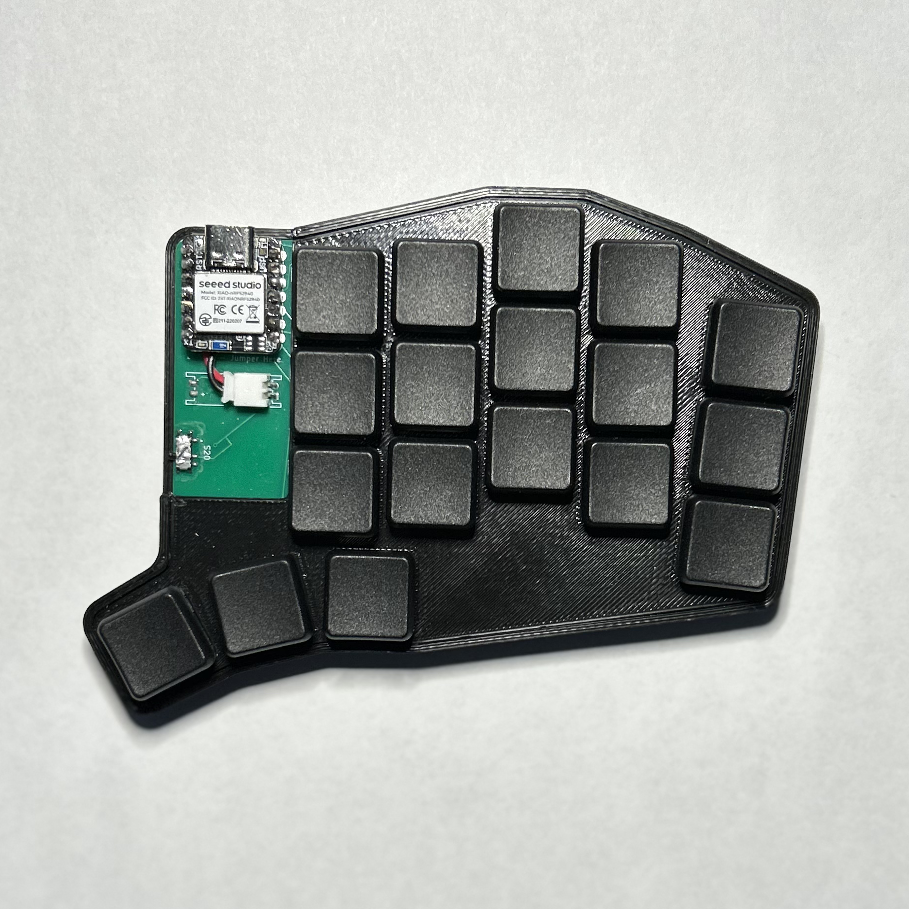

These projects span my time as an undergraduate student. They cover major class assignments in the BYU Electrical & Computer Engineering and Computer Science departments, tasks as a research assistant in the MAGICC lab, and personal projects I've completed in my spare time.

  

    <ul class="md-filter__list">
      <li class="md-filter__item">
        <input type="radio" name="filter" id="all" checked>
        <label for="all">All</label>
      </li>
      <li class="md-filter__item">
        <input type="radio" name="filter" id="filter-software">
        <label for="filter-software">Software</label>
      </li>
      <li class="md-filter__item">
        <input type="radio" name="filter" id="filter-hardware">
        <label for="filter-hardware">Hardware</label>
      </li>
      <li class="md-filter__item">
        <input type="radio" name="filter" id="filter-robotics">
        <label for="filter-robotics">Robotics</label>
      </li>
    </ul>
  

- [**Keyboard Project**](projects/keyboard.md)

    ---

    A custom split keyboard.

    Hardware
    Software

    [{ align = center }](projects/keyboard.md)

- [**Raspberry Pi Doorbell**](projects/doorbell.md)

    ---

    ECEN 225

    Hardware
    Software

- [**Light Following Robot**](projects/light_following_robot.md)

    ---

    ECEN 240

    Robotics

- [**C Battleship**](projects/c_battleship.md)

    ---

    ECEN 330

    Software

- [**RustFlight**](projects/rustflight.md)

    ---

    MAGICC Lab

    Hardware
    Software

- [**Rust Demos**](projects/rust_demos.md)

    ---

    Rust Programming Language

    Software

- [**This website!**](projects/website.md)

    ---

    Material for MKDocs

    Software

