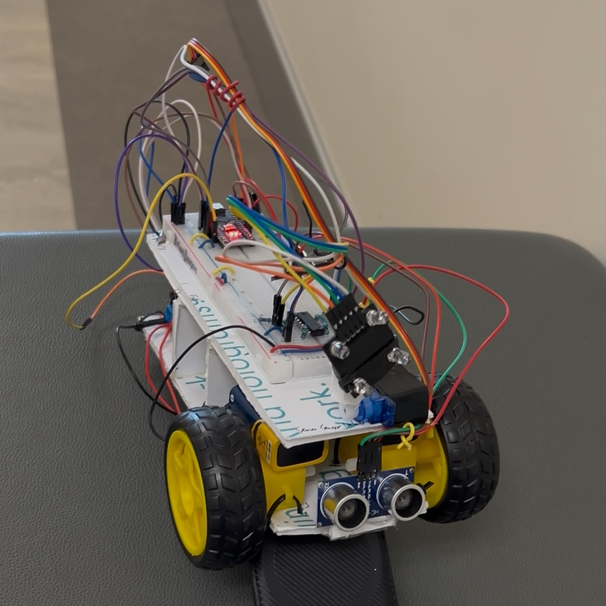

These projects span my time as an undergraduate student...

  <button class="button is-checked" data-filter="*">All</button>
  <button class="button" data-filter=".software">Software</button>
  <button class="button" data-filter=".hardware">Hardware</button>
  <button class="button" data-filter=".magicc">MAGICC LAB</button>

- [**ROSflight**](projects/rustflight.md){: data-tags="software hardware magicc"}

    ---

    MAGICC Lab

    Software
    Hardware
    MAGICC Lab

    

- [**Rust Demos**](projects/rust_demos.md){: data-tags="software magicc"}

    ---

    Rust Programming Language

    Software
    MAGICC Lab

    

- [**Keyboard Project**](projects/keyboard.md){: data-tags="hardware"}

    ---

    A custom split keyboard.

    Hardware

    

- [**Raspberry Pi Doorbell**](projects/doorbell.md){: data-tags="hardware software"}

    ---

    ECEN 225 (Computer Systems) Lab

    Hardware
    Software

    

- [**Light Following Robot**](projects/light_following_robot.md){: data-tags="hardware software"}

    ---

    ECEN 240 (Circuits) Lab

    Hardware
    Software

    

- [**C Battleship**](projects/c_battleship.md){: data-tags="software"}

    ---

    ECEN 330 (Embedded Programming) Lab

    Software

    

- [**Chess Project**](projects/chess.md){: data-tags="software"}

    ---

    CS 240 (Adv. Software Construction)

    Software

    

- [**This website!**](projects/website.md){: data-tags="software"}

    ---

    Material for MKDocs

    Software

    

