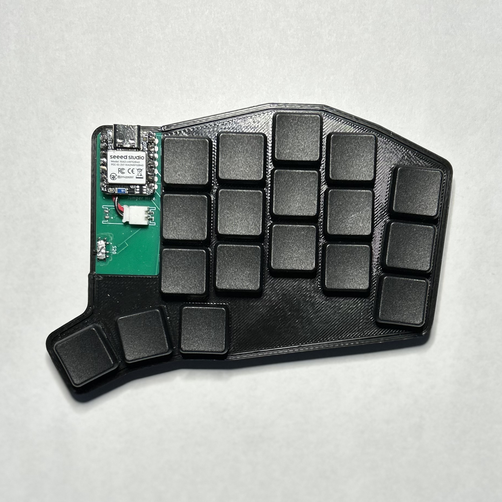
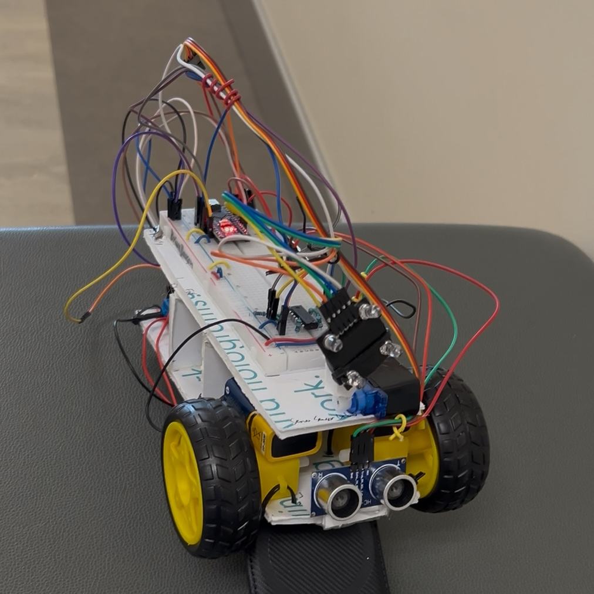

These projects span my time as an undergraduate student. They cover major class assignments in the BYU Electrical & Computer Engineering and Computer Science departments, tasks as a research assistant in the MAGICC lab, and personal projects I've completed in my spare time.

- [**Keyboard Project**](projects/keyboard.md)

    ---

    A custom split keyboard.

    [{ align = center }](projects/keyboard.md)

- [**RustFlight**](projects/rustflight.md)

    ---

    MAGICC Lab

    

- [**Raspberry Pi Doorbell**](projects/doorbell.md)

    ---

    ECEN 225 (Computer Systems) Lab

    

- [**Rust Demos**](projects/rust_demos.md)

    ---

    Rust Programming Language

    

- [**Chess Project**](projects/chess.md)

    ---

    CS 240 (Adv. Software Construction)

    

- [**C Battleship**](projects/c_battleship.md)

    ---

    ECEN 330 (Embedded Programming) Lab

    

- [**Light Following Robot**](projects/light_following_robot.md)

    ---

    ECEN 240 (Circuits) Lab

    

- [**This website!**](projects/website.md)

    ---

    Material for MkDocs

    

